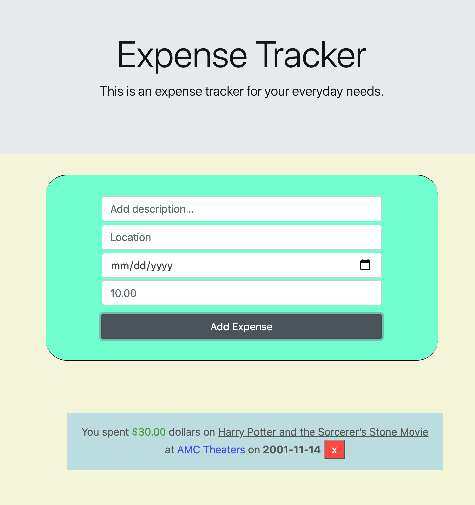

# theExpenseTracker-App

HTML, CSS, JS, REACT

-React Hooks

-ContextAPI

-Description: User has the ability to add a new expense and to delete an expense if desired.

<small>Live Link: https://the-expense-tracker-app.herokuapp.com/</small>

<h2>Summary</h2>

I've always wanted to learn React because of its popularity and functionality. I wanted to learn how to use React hooks and the contextAPI for state management more specifically. This ExpenseTracker App is a good way to practice the basics of what I have been reading online so far (React Hooks, ContextAPI, Props & Components) on the React Doc. Webpage and other sources.

<h2>Author</h2>

Roger Alexander - Full Stack Developer <a href="http://www.douschesois.com">Portfolio Website</a>
